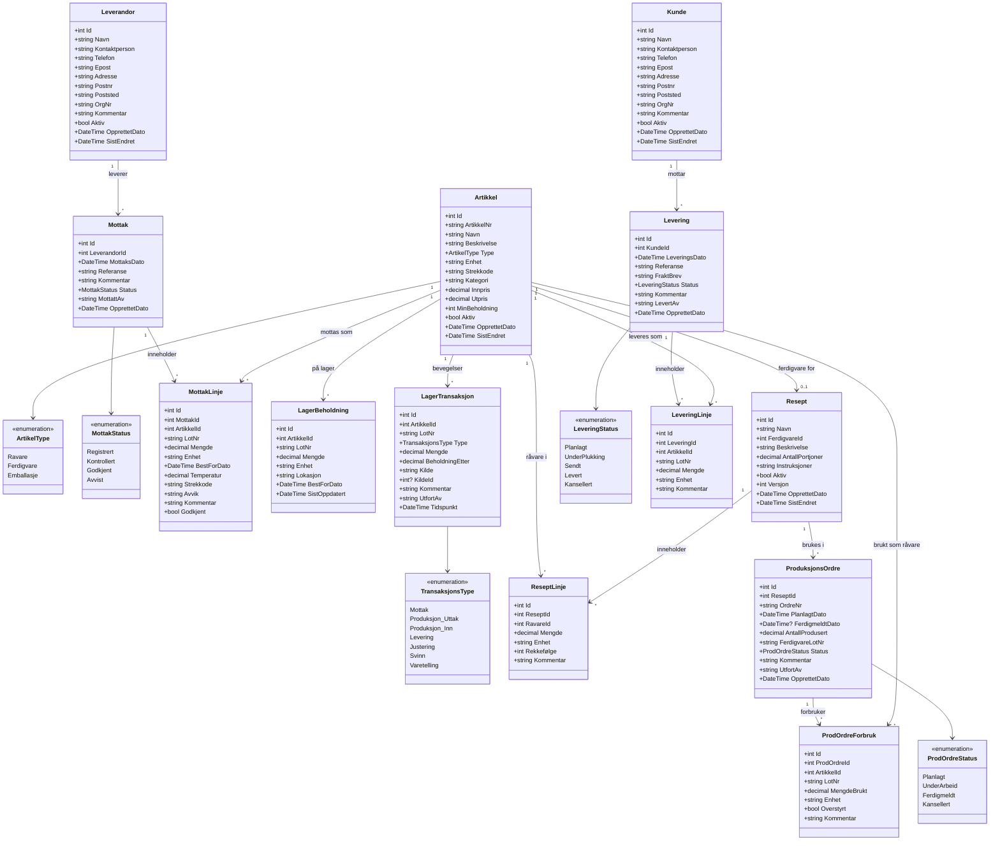

# LagerPro — Klassediagram (Mermaid)

```mermaid
classDiagram
    direction TB

    %% ═══════════════════════════════════════
    %% STAMDATA
    %% ═══════════════════════════════════════

    class Leverandor {
        +int Id
        +string Navn
        +string Kontaktperson
        +string Telefon
        +string Epost
        +string Adresse
        +string Postnr
        +string Poststed
        +string OrgNr
        +string Kommentar
        +bool Aktiv
        +DateTime OpprettetDato
        +DateTime SistEndret
    }

    class Artikkel {
        +int Id
        +string ArtikkelNr
        +string Navn
        +string Beskrivelse
        +ArtikelType Type
        +string Enhet
        +string Strekkode
        +string Kategori
        +decimal Innpris
        +decimal Utpris
        +int MinBeholdning
        +bool Aktiv
        +DateTime OpprettetDato
        +DateTime SistEndret
    }

    class ArtikelType {
        <<enumeration>>
        Ravare
        Ferdigvare
        Emballasje
    }

    class Kunde {
        +int Id
        +string Navn
        +string Kontaktperson
        +string Telefon
        +string Epost
        +string Adresse
        +string Postnr
        +string Poststed
        +string OrgNr
        +string Kommentar
        +bool Aktiv
        +DateTime OpprettetDato
        +DateTime SistEndret
    }

    %% ═══════════════════════════════════════
    %% MOTTAK
    %% ═══════════════════════════════════════

    class Mottak {
        +int Id
        +int LeverandorId
        +DateTime MottaksDato
        +string Referanse
        +string Kommentar
        +MottakStatus Status
        +string MottattAv
        +DateTime OpprettetDato
    }

    class MottakStatus {
        <<enumeration>>
        Registrert
        Kontrollert
        Godkjent
        Avvist
    }

    class MottakLinje {
        +int Id
        +int MottakId
        +int ArtikkelId
        +string LotNr
        +decimal Mengde
        +string Enhet
        +DateTime BestForDato
        +decimal Temperatur
        +string Strekkode
        +string Avvik
        +string Kommentar
        +bool Godkjent
    }

    %% ═══════════════════════════════════════
    %% LAGER
    %% ═══════════════════════════════════════

    class LagerBeholdning {
        +int Id
        +int ArtikkelId
        +string LotNr
        +decimal Mengde
        +string Enhet
        +string Lokasjon
        +DateTime BestForDato
        +DateTime SistOppdatert
    }

    class LagerTransaksjon {
        +int Id
        +int ArtikkelId
        +string LotNr
        +TransaksjonsType Type
        +decimal Mengde
        +decimal BeholdningEtter
        +string Kilde
        +int? KildeId
        +string Kommentar
        +string UtfortAv
        +DateTime Tidspunkt
    }

    class TransaksjonsType {
        <<enumeration>>
        Mottak
        Produksjon_Uttak
        Produksjon_Inn
        Levering
        Justering
        Svinn
        Varetelling
    }

    %% ═══════════════════════════════════════
    %% PRODUKSJON
    %% ═══════════════════════════════════════

    class Resept {
        +int Id
        +string Navn
        +int FerdigvareId
        +string Beskrivelse
        +decimal AntallPortjoner
        +string Instruksjoner
        +bool Aktiv
        +int Versjon
        +DateTime OpprettetDato
        +DateTime SistEndret
    }

    class ReseptLinje {
        +int Id
        +int ReseptId
        +int RavareId
        +decimal Mengde
        +string Enhet
        +int Rekkefølge
        +string Kommentar
    }

    class ProduksjonsOrdre {
        +int Id
        +int ReseptId
        +string OrdreNr
        +DateTime PlanlagtDato
        +DateTime? FerdigmeldtDato
        +decimal AntallProdusert
        +string FerdigvareLotNr
        +ProdOrdreStatus Status
        +string Kommentar
        +string UtfortAv
        +DateTime OpprettetDato
    }

    class ProdOrdreStatus {
        <<enumeration>>
        Planlagt
        UnderArbeid
        Ferdigmeldt
        Kansellert
    }

    class ProdOrdreForbruk {
        +int Id
        +int ProdOrdreId
        +int ArtikkelId
        +string LotNr
        +decimal MengdeBrukt
        +string Enhet
        +bool Overstyrt
        +string Kommentar
    }

    %% ═══════════════════════════════════════
    %% LEVERING
    %% ═══════════════════════════════════════

    class Levering {
        +int Id
        +int KundeId
        +DateTime LeveringsDato
        +string Referanse
        +string FraktBrev
        +LeveringStatus Status
        +string Kommentar
        +string LevertAv
        +DateTime OpprettetDato
    }

    class LeveringStatus {
        <<enumeration>>
        Planlagt
        UnderPlukking
        Sendt
        Levert
        Kansellert
    }

    class LeveringLinje {
        +int Id
        +int LeveringId
        +int ArtikkelId
        +string LotNr
        +decimal Mengde
        +string Enhet
        +string Kommentar
    }

    %% ═══════════════════════════════════════
    %% RELASJONER
    %% ═══════════════════════════════════════

    Leverandor "1" --> "*" Mottak : leverer
    Mottak "1" --> "*" MottakLinje : inneholder
    Artikkel "1" --> "*" MottakLinje : mottas som

    Artikkel "1" --> "*" LagerBeholdning : på lager
    Artikkel "1" --> "*" LagerTransaksjon : bevegelser

    Artikkel "1" --> "0..1" Resept : ferdigvare for
    Artikkel "1" --> "*" ReseptLinje : råvare i
    Resept "1" --> "*" ReseptLinje : inneholder
    Resept "1" --> "*" ProduksjonsOrdre : brukes i
    ProduksjonsOrdre "1" --> "*" ProdOrdreForbruk : forbruker
    Artikkel "1" --> "*" ProdOrdreForbruk : brukt som råvare

    Kunde "1" --> "*" Levering : mottar
    Levering "1" --> "*" LeveringLinje : inneholder
    Artikkel "1" --> "*" LeveringLinje : leveres som

    Artikkel --> ArtikelType
    Mottak --> MottakStatus
    LagerTransaksjon --> TransaksjonsType
    ProduksjonsOrdre --> ProdOrdreStatus
    Levering --> LeveringStatus
```
